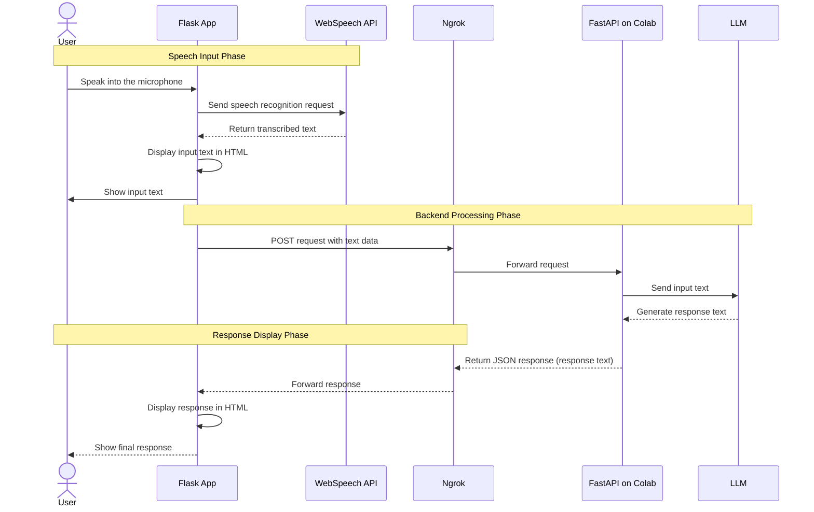

# Speech Recognition Web App

Simple web app where you can talk to then receive immediate text response.



# How to use it

1. After cloning, add the following line to the existing `.env` file.

```
OPENAI_API_KEY="<your-openai-api-key>"
```

2. Build docker image by running the following command:

```
docker compose build
```

3. Boot the container by doing:

```
docker compose up
```

4. Go to http://localhost:5000.
