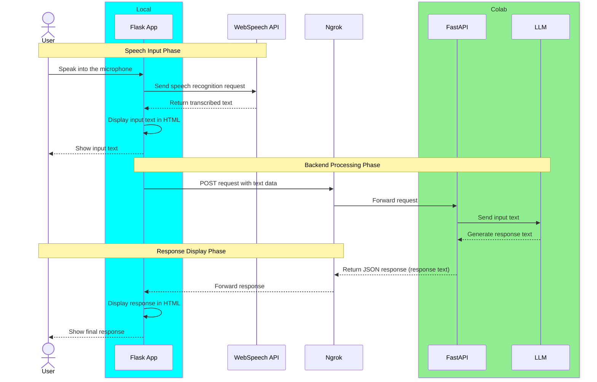

# Voice Assistant Web Application 
This app, built with Meta Llama 3, combines local voice processing with cloud-based language model capabilities, creating a seamless voice-to-text-to-response system.

## Demo


## Architecture overview
1. Local Flask Application
 - Captures user voice input through the browser including chrome, safari and opera
 - Leverages WebSpeechAPI for real-time speech-to-text conversion
 - Sends text to Colab server to undergo LLM inferences
 - Renders final response back to the user

2. Colab Server with FastAPI
 - Exposed to the internet via Ngrok tunneling
 - Receives text input from the local Flask application
 - Processes the input through a large language model (LLM)
 - Returns the response to the local application

## Data Flow


# How to use

1. Run `llm_fastapi_elyza_colab.ipynb` on Google Colaboratory.
 
2. Add the following line to the existing `.env` file.
```
LLM_URL="<ngrok_url>"
```

3. Build docker image by running the following command:

```
docker compose build
```

4. Boot the container by doing:

```
docker compose up
```

5. Go to http://localhost:5000.
